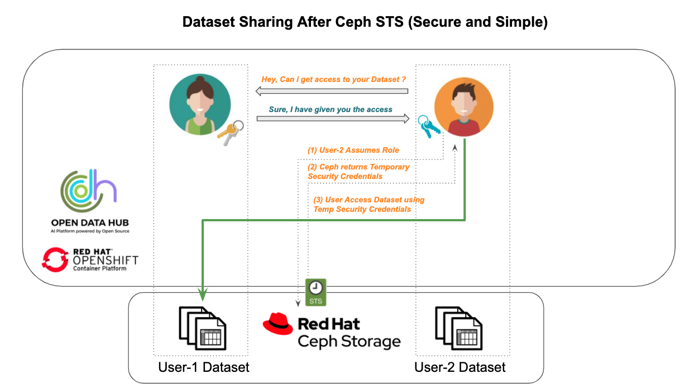

# What is STS

Secure Token Service is a web service in AWS that returns a set of temporary security credentials for authenticating federated users. Ceph Object Gateway implements a subset of STS APIs that provide temporary credentials for identity and access management. These temporary credentials can be used to make subsequent S3 calls which will be authenticated by the STS engine in Ceph Object Gateway. Permissions of the temporary credentials can be further restricted via an IAM policy passed as a parameter to the STS APIs.

# Dataset sharing before Ceph RGW STS


# Dataset sharing after Ceph RGW STS




# Stp-1 : Enable STS in Ceph RadosGW

By default STS feature in Ceph is disabled, this needs to be enabled either at RGW runtime or during ceph deployment

- Make sure the following lines should exist in ``ceph.conf`` global section. This could be automated at the time of ceph deployment
```
rgw sts key = abcdefghijklmnop
rgw s3 auth use sts = true
```

# Step-2 : Create Ceph RadosGW users with Admin capabilities

The Ceph Storage Cluster provides an administrative API that enables users to execute administrative functions via the REST API. By default, users do NOT have access to this API. To enable a user to exercise administrative functionality, provide the user with administrative capabilities.

Admin capabilities can be attached to existing RGW users or could be attached at the time of RGW user creation like below

```
radosgw-admin user create --tenant odh --uid user1 --display-name "user1" --access_key user1 --secret user1pass --caps="roles=*"
radosgw-admin user create --tenant odh --uid user2 --display-name "user2" --access_key user2 --secret user2pass --caps="roles=*"
```
# Step-3 : Testing Ceph RWG STS Feature
### Prerequisite : OCP 4.5 , ODH 0.8+ , OCS 4.5

Execute the following python notebooks one-by-one

1) [Preparation Notebook](sts-demo1/Prepare.ipynb)
2) [User-1](sts-demo1/user1.ipynb)
3) [User-2](sts-demo1/user2.ipynb)

